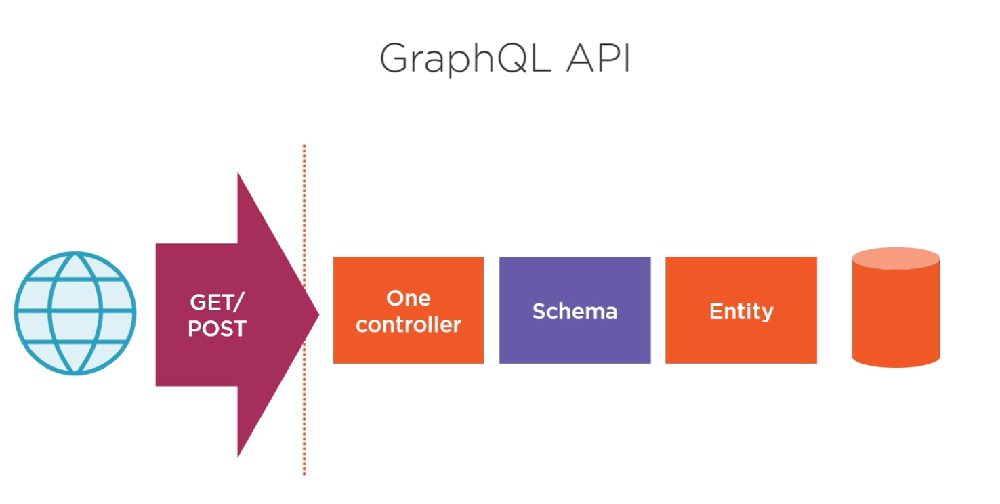

# GraphQL 介绍

## 1. GraphQL基础概念

### 1.1 GraphQL简介

#### 1.1.1 GraphQL是什么

- GraphQL是一种用于API的查询语言，它由Facebook于2012年开发，并于2015年首次公开发布。GraphQL旨在提供更高效、灵活和强大的API查询和数据获取方式。
- 与传统的[RESTful API](https://zhida.zhihu.com/search?content_id=239160639&content_type=Article&match_order=1&q=RESTful+API&zd_token=...&zhida_source=entity)不同，GraphQL允许客户端精确地指定需要获取的数据，从而避免了过度获取或缺少数据的问题。
- 它基于类型系统，并提供了强大的查询语言，允许客户端自由组合和嵌套查询，并获取所需的精确数据。
- 1.1.2 GraphQL的优势

- 通过减少网络请求次数，GraphQL显著提升了API的性能。例如，一个复杂的页面在REST中可能需要多个请求，而GraphQL只需一个。
- 它支持强类型系统和模式自省，使得客户端可以提前了解API的结构，便于开发和调试。

#### 1.1.3 基本术语

- **Schema**：定义了API的结构，包括类型、字段和查询等。
- **Query**：客户端用来请求数据的表达式，可以指定需要哪些字段。
- **Mutation**：用于修改数据的操作，如创建、更新或删除。
- **Subscription**：允许客户端订阅数据变化，实时获取更新。

### 1.2 GraphQL和REST API的区别

GraphQL 和 REST API 之间主要的区别：

- 使用 GraphQL，只需要使用一个终结点，而使用 REST API 的 API 终结点需要很多 个。由于应用中只有一个终结点，因此在应用程序扩展时维护 GraphQL 会更加容易。

| 对比维度         | REST API                                                    | GraphQL                                                      | GraphQL  优势 |
| ---------------- | ----------------------------------------------------------- | ------------------------------------------------------------ | ------------- |
| **设计理念**     | 基于资源的架构，通过URI和HTTP方法操作资源，强调无状态性。   | 查询语言和运行时，允许客户端精确请求所需数据，解决REST的不足。 |               |
| **请求方式**     | 不同URI和HTTP方法对应不同操作，如`GET /users`获取用户列表。 | 通过统一端点（如`/graphql`）发送查询（query）或变异（mutation）。 | √             |
| **数据获取**     | 固定数据结构，可能过度获取或不足获取，多层数据需多次请求。  | 客户端可一次性请求所需数据，避免多次请求，减少数据传输量。   | √             |
| **性能和灵活性** | 数据结构简单时性能好，复杂数据结构灵活性差。                | 复杂数据结构性能更好，灵活性高，客户端可自由请求数据。       | √             |
| **缓存**         | 缓存简单，通过HTTP缓存机制按URI缓存资源。                   | 缓存复杂，因请求动态，不能简单通过URI缓存。                  |               |
| **版本控制**     | 通过URI添加版本号（如`/v1/users`），但URI可能变得复杂。     | 不需在URI中体现版本，通过查询语言调整数据结构，但需严格后端管理。 | √             |
| **开发和维护**   | 开发简单，按资源划分设计API；维护容易，接口功能单一。       | 开发初期需学习GraphQL，维护复杂，统一端点问题影响大。        |               |
| **适用场景**     | 数据结构简单、请求固定的应用，如传统Web应用。               | 数据结构复杂、多层关联数据、客户端需求多变的应用，如移动应用。 |               |

 

### 1.3 为什么选择GraphQL？

1. 灵活性：GraphQL允许客户端精确地定义需要的数据结构和字段，避免了过度获取或缺少数据的问题。这种灵活性使得前端开发人员能够更自由地设计和开发UI，并减少后端API变更对前端的影响。
2. 性能优化：GraphQL使用单一请求来获取所有需要的数据，减少了多次请求的开销，并且允许在一个请求中获取多个资源的数据。这种方式可以减少网络延迟，并提高应用程序的性能。
3. 自描述性：GraphQL使用类型系统和强大的查询语言，使得API具有自描述性。客户端可以通过introspection查询来了解API的结构和可用字段，从而更好地理解和使用API。
4. 生态系统支持：GraphQL拥有活跃的社区和丰富的生态系统。许多主流编程语言都有GraphQL的库和工具支持，使得开发人员能够快速上手和使用GraphQL。

## 2 GraphQL 设计原则

### 2.1 完整原则

确保Graph被明确定义、稳定且一致

------

#### [1. 单一Graph](https://principles.graphql.cn/integrity#1-单一图)

你的公司应当只有一个统一的Graph，而不是多个团队分别创建的多个Graph。

#### [2. 联合实现](https://principles.graphql.cn/integrity#2-联合实现)

虽然只有一个Graph，但该Graph应该由多个团队联合实现。

#### [3. 追踪在注册表中的 Schema](https://principles.graphql.cn/integrity#3-追踪在注册表中的-schema)

注册和追踪Graph时应当有一个单一的事实来源。

### 2.2 敏捷原则

快速推出Graph并适应不断变化的需求

------

#### [4. 抽象、面向需求的 Schema](https://principles.graphql.cn/agility#4-抽象、面向需求的-schema)

Schema 应当作为抽象层以隐藏服务实现细节并为消费者提供灵活性。

#### [5. 使用敏捷方法进行 Schema 开发](https://principles.graphql.cn/agility#5-使用敏捷方法进行-schema-开发)

Schema 应当根据实际需求增量构建，并随着时间的推移平滑演进。

#### [6. 迭代地提高性能](https://principles.graphql.cn/agility#6-迭代地提高性能)

性能管理应当是一个连续的、数据驱动的过程，可以平滑地适应不断变化的查询负载和服务实现。

#### [7. 使用Graph的元数据为开发人员提供支持](https://principles.graphql.cn/agility#7-使用图的元数据为开发人员提供支持)

开发人员应当在整个开发过程中对Graph充分了解。

### 2.3 操作原则

安全地将Graph大规模部署到生产中

------

#### [8. 访问和需求控制](https://principles.graphql.cn/operations#8-访问和需求控制)

基于每个客户端授予对Graph的访问权限，并管理客户端可以访问的内容和方式。

#### [9. 结构化日志](https://principles.graphql.cn/operations#9-结构化日志)

捕获所有Graph操作的结构化日志，并以之为主要工具了解Graph的使用情况。

#### [10. 将 GraphQL 层从服务层分离](https://principles.graphql.cn/operations#10-将-graphql-层从服务层分离)

采用分层架构将数据Graph功能分解为单独的层，而不是融入到每个服务中。

##  参考资料

[1] [GraphQL .NET](https://graphql-dotnet.github.io/docs/getting-started/introduction/)

[2] http://graphql.org/learn

[3] https://github.com/facebook/graphql

[4] https://graphql.cn/