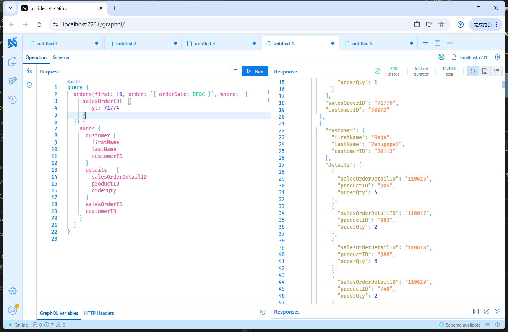
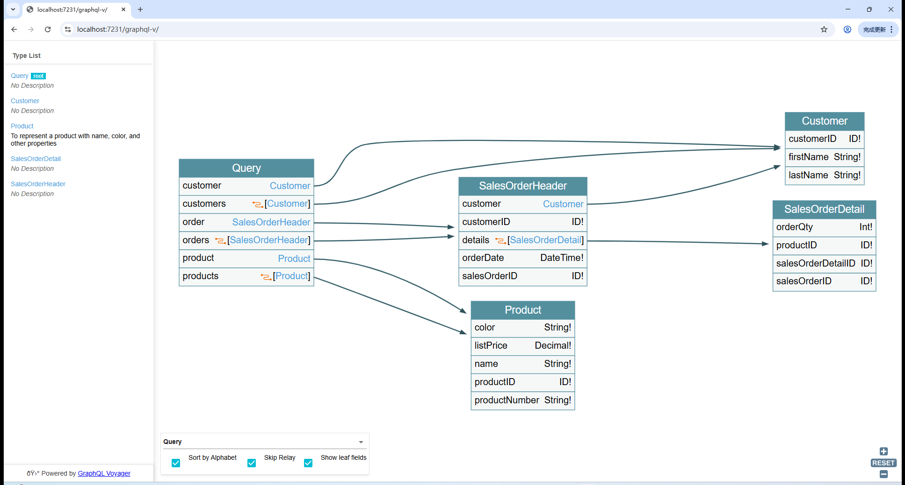

# 实战Aspnet Core实现GraphQL API

在现代 web 开发中，GraphQL 已经成为一种流行的选择，它允许客户端精确地请求所需的数据，而服务器只返回请求的数据。

本文将介绍如何使用 Dapper 和 OLDB 访问 Adventure Works 数据库，并结合 HotChocolate 框架在 ASP.NET Core 中实现一个带有用户权限判断的 GraphQL API。

## 1. 环境准备

首先，确保你已经安装了以下工具和库：
- **.NET 8 SDK**：用于开发 ASP.NET Core 应用程序。
- **Dapper**：一个轻量级的 ORM，用于简化数据库操作。
- **System.Data.OleDb**：用于通过 OLE DB 访问数据库。
- **HotChocolate**：一个用于构建 GraphQL API 的框架。

## 2. 创建 ASP.NET Core 项目

使用 .NET CLI 创建一个新的 ASP.NET Core Web API 项目：
```bash
dotnet new webapi -n DataPlatform.GraphQL.API
cd DataPlatform.GraphQL.API
```

## 3. 安装必要的 NuGet 包

安装 Dapper、System.Data.OleDb 和 HotChocolate 相关的 NuGet 包：
```bash
dotnet add package Dapper

dotnet add package HotChocolate
dotnet add package HotChocolate.AspNetCore
dotnet add package HotChocolate.AspNetCore.Authorization
dotnet add package HotChocolate.AspNetCore.Playground
dotnet add package HotChocolate.AspNetCore.Voyager
dotnet add package HotChocolate.Data

dotnet add package Newtonsoft.Json
dotnet add package System.Data.Odbc
```

## 4. 配置数据库连接

在 `appsettings.json` 中配置数据库连接字符串：
```json
{
  "ConnectionStrings": {
    "AdventureWorks": "DSN=advworks;UID=CloudSA13a62506;PWD=${ADVW_DB_PASSWORD};"
  }
}
```

## 5. 创建数据访问层

创建一个 `Data` 文件夹，并在其中创建 `AdventureWorksRepository.cs` 文件：
```csharp
namespace DataPlatform.GraphQL.API;

using Dapper;

using System.Collections.Generic;
using System.Data;
using System.Data.Odbc;
using System.Linq;

public class DataAccess
{
    private readonly string _connectionString;

    public DataAccess(IConfiguration configuration)
    {
        _connectionString = configuration.GetConnectionString("AdventureWorksConnection");

    }

    public List<Product> GetProducts(QueryArgs args)
    {
        using (IDbConnection db = new OdbcConnection(_connectionString))
        {
            string query = "SELECT ProductID, Name, ListPrice FROM SalesLT.Product";
            if (args != null)
            {
                query = args.Decorate(query);
            }
            return db.Query<Product>(query).ToList();
        }
    }

    public Product? GetProduct(int productId)
    {
        using (IDbConnection db = new OdbcConnection(_connectionString))
        {
            string query = $"SELECT ProductID, Name, ListPrice, Color, ProductNumber FROM SalesLT.Product WHERE ProductID = {productId}";

            return db.QuerySingleOrDefault<Product>(query);
        }
    }

    // Customer , Order , OrderDetail
    public IEnumerable<Customer> GetCustomers(QueryArgs args)
    {
        using (IDbConnection db = new OdbcConnection(_connectionString))
        {
            string query = "SELECT CustomerID, FirstName, LastName FROM SalesLT.Customer";
            if (args != null)
            {
                query = args.Decorate(query);
            }

            return db.Query<Customer>(query);
        }
    }

    public IEnumerable<SalesOrderHeader> GetOrders(QueryArgs? args)
    {
        using (IDbConnection db = new OdbcConnection(_connectionString))
        {
            string query = "SELECT SalesOrderID, OrderDate, CustomerID FROM SalesLT.SalesOrderHeader ";
            if (args != null)
            {
                query = args.Decorate(query);
            }

            return db.Query<SalesOrderHeader>(query);
        }
    }

    public IEnumerable<SalesOrderDetail> GetOrderDetails(int orderId, QueryArgs? args)
    {
        using (IDbConnection db = new OdbcConnection(_connectionString))
        {
            string query = $"SELECT SalesOrderID, SalesOrderDetailID, ProductID, OrderQty FROM SalesLT.SalesOrderDetail ";
            if (args != null)
            {
                query = args.Decorate(query);
            }
            return db.Query<SalesOrderDetail>(query);


        }
    }

    public Dictionary<int, List<SalesOrderDetail>> GetOrderDetails(int[] orderIds)
    {
        using (IDbConnection db = new OdbcConnection(_connectionString))
        {
            var id_list = string.Join(",", orderIds);
            string query = $"SELECT SalesOrderID, SalesOrderDetailID, ProductID, OrderQty FROM SalesLT.SalesOrderDetail WHERE SalesOrderID in ({id_list}) ";

            return db.Query<SalesOrderDetail>(query)
                   .GroupBy(p => p.SalesOrderID)
                   .ToDictionary(g => g.Key, g => g.ToList());
        }
    }
    public SalesOrderHeader? GetSalesOrder(int orderId)
    {
        using (IDbConnection db = new OdbcConnection(_connectionString))
        {
            return db.QueryFirstOrDefault<SalesOrderHeader>($"SELECT SalesOrderID, OrderDate, CustomerID FROM SalesLT.SalesOrderHeader WHERE SalesOrderID = {orderId}");
        }
    }


    public Customer? GetCustomer(int customerId)
    {
        using (IDbConnection db = new OdbcConnection(_connectionString))
        {
            return db.QueryFirstOrDefault<Customer>($"SELECT * FROM SalesLT.Customer WHERE CustomerID = {customerId}");
        }
    }

    public Dictionary<int, Customer> GetCustomers(int[] customerIds)
    {
        using (IDbConnection db = new OdbcConnection(_connectionString))
        {
            var id_list = string.Join(",", customerIds);
            var result = db.Query<Customer>($"SELECT * FROM SalesLT.Customer WHERE CustomerID in ({id_list})")
                    .ToDictionary(p => p.CustomerID);

            return result;
        }
    }
}


```


## 6. 定义 GraphQL 类型

`Models.cs` 文件

~~~c#
namespace DataPlatform.GraphQL.API;
 
[GraphQLDescription("To represent a product with name, color, and other properties")]
public class Product
{
    [GraphQLDescription("The unique identifier for the product")]
    [ID]
    public int ProductID { get; set; }

    [GraphQLDescription("The name of the product")]
    public required string Name { get; set; }

    [GraphQLDescription("The product number, like 'S700'")]
    public string? ProductNumber { get; set; }

    [GraphQLDescription("The list price of the product")]
    public Decimal? ListPrice { get; set; }

    [GraphQLDescription("The color of the product")]
    public string? Color { get; set; }
    // Add other properties as needed
}

public class Customer
{
    public int CustomerID { get; set; }
    public string? FirstName { get; set; }
    public string? LastName { get; set; }
    // Add other properties as needed
}

public class SalesOrderHeader
{
    public int SalesOrderID { get; set; }
    public DateTime OrderDate { get; set; }
    public int CustomerID { get; set; }
    // Add other properties as needed
}

public class SalesOrderDetail
{
    public int SalesOrderID { get; set; }
    public int SalesOrderDetailID { get; set; }
    public int ProductID { get; set; }
    public int OrderQty { get; set; }
    // Add other properties as needed
}

~~~


`MyGraphTypes` 文件：

```csharp
namespace DataPlatform.GraphQL.API;
public class ProductType : ObjectType<Product>
{
    protected override void Configure(IObjectTypeDescriptor<Product> descriptor)
    {
        descriptor.Field(p => p.ProductID).Type<NonNullType<IdType>>();
        descriptor.Field(p => p.Name).Type<NonNullType<StringType>>();
        descriptor.Field(p => p.ListPrice).Type<NonNullType<DecimalType>>();
        descriptor.Field(p => p.ProductNumber).Type<NonNullType<StringType>>();
        descriptor.Field(p => p.Color).Type<NonNullType<StringType>>();

    }
}

public class CustomerType : ObjectType<Customer>
{
    protected override void Configure(IObjectTypeDescriptor<Customer> descriptor)
    {
        descriptor.Field(p => p.CustomerID).Type<NonNullType<IdType>>();
        descriptor.Field(p => p.FirstName).Type<NonNullType<StringType>>();
        descriptor.Field(p => p.LastName).Type<NonNullType<StringType>>();

    }

}

public class SalesOrderDetailType : ObjectType<SalesOrderDetail>
{
    protected override void Configure(IObjectTypeDescriptor<SalesOrderDetail> descriptor)
    {
        descriptor.Field(p => p.SalesOrderID).Type<NonNullType<IdType>>();
        descriptor.Field(p => p.SalesOrderDetailID).Type<NonNullType<IdType>>();
        descriptor.Field(p => p.ProductID).Type<NonNullType<IdType>>();

        // product
        //descriptor.Field(p => p.Product).Type<ProductType>();
    }
}

public class SalesOrderHeaderType : ObjectType<SalesOrderHeader>
{
    protected override void Configure(IObjectTypeDescriptor<SalesOrderHeader> descriptor)
    {
        descriptor.Field(p => p.SalesOrderID).Type<NonNullType<IdType>>();
        descriptor.Field(p => p.OrderDate).Type<NonNullType<DateTimeType>>();
        descriptor.Field(p => p.CustomerID).Type<NonNullType<IdType>>();

        //user data loader
        descriptor.Field("customer")
                    //.UseDataLoader<CustomerDataLoader>()
                    .Resolve<Customer?>(async _ =>
                    {
                        var loader = _.DataLoader<CustomerDataLoader>();
                        int customerID = _.Parent<SalesOrderHeader>().CustomerID;
                        var result = await loader.LoadAsync(customerID);
                        return result;
                    })
        ;

        descriptor.Field("details")
                  .UsePaging()   // 支持分页
                  .UseFiltering()  // 支持筛选
                  .UseSorting()  // 支持排序
                  .Resolve<List<SalesOrderDetail>>(async _ =>
                  {
                     
                      var loader = _.DataLoader<OrderDetailsDataLoader>();
                      int salesOrderID = _.Parent<SalesOrderHeader>().SalesOrderID;
                      var result = await loader.LoadAsync(salesOrderID);
                      return result;
                  }
            );
    }
}

```

`Query.cs` 文件

```csharp
namespace DataPlatform.GraphQL.API;

public class Query
{
    private readonly DataAccess _dataAccess;

    public Query(DataAccess dataAccess)
    {
        _dataAccess = dataAccess;
    }


    [GraphQLDescription("Retrieve product by id")]
    public Product? GetProduct(int productId) => _dataAccess.GetProduct(productId);


    [GraphQLDescription("Retrieve sales order data by id")]
    public SalesOrderHeader? GetOrder(int orderId) => _dataAccess.GetSalesOrder(orderId);


    [GraphQLDescription("Retrieve customer data by id")]
    public Customer? GetCustomer(int customerId) => _dataAccess.GetCustomer(customerId);

    [UsePaging, UseSorting, UseFiltering]
    [GraphQLDescription("Retrieve product list, supports pagination, sorting, and filtering")]
    public IQueryable<Product> GetProducts() => _dataAccess.GetProducts(null).AsQueryable();
    [UsePaging, UseSorting, UseFiltering]
    [GraphQLDescription("Retrieve customer list, supports pagination, sorting, and filtering")]
    public IQueryable<Customer> GetCustomers() => _dataAccess.GetCustomers(null).AsQueryable();


    [UsePaging, UseSorting, UseFiltering]
    [GraphQLDescription("Retrieve order list, supports pagination, sorting, and filtering")]

    public IQueryable<SalesOrderHeader> GetOrders() => _dataAccess.GetOrders(null).AsQueryable();

}
 
```

## 7. 配置 GraphQL 服务

在 `Startup.cs` 中配置 GraphQL 服务：
```csharp
using HotChocolate.AspNetCore.Voyager;

namespace DataPlatform.GraphQL.API
{


    public class Program
    {
        public static void Main(string[] args)
        {
            var builder = WebApplication.CreateBuilder(args);
            var services = builder.Services;

            // Add services to the container.
        

            builder.Services
                    .AddGraphQLServer() // 指定模式名称
                    .AddSorting()
                    .AddQueryType<Query>()
                    .AddTypes(typeof(ProductType)
                            , typeof(CustomerType)
                            , typeof(SalesOrderDetailType)
                            , typeof(SalesOrderHeaderType)
                            , typeof(QueryArgs)
                           
                    ;
            builder.Services.AddSingleton<DataAccess>();
            var app = builder.Build();

            // Configure the HTTP request pipeline.
            if (app.Environment.IsDevelopment())
            {
                app.UseDeveloperExceptionPage();
            }

            app.MapGraphQL("/graphql", schemaName: null);
            app.UseVoyager("/graphql", "/graphql-v");
            app.Run();
        }
    }
}

```

## 8. 测试 GraphQL API

运行项目：
```bash
dotnet run
```

打开浏览器，访问以下 URL 测试 GraphQL API：
- **GraphQL Playground**：`http://localhost:5000/graphql`



在 GraphQL Playground 中，你可以执行以下查询：
```graphql
// 根据id查询
// 同时查询多个实体
query {
  product(productId: 707) {
    name
    productID
  }
  customer(customerId: 12) {
    firstName
    lastName
  }
}

```

根据实体ID查询获得实体信息。

或者：

```graphql
query {
  orders(
    // 分页
    first: 3
    // 排序
    order: [{ orderDate: DESC }]
    // 筛选
    where: { salesOrderID: { gt: 71776 } }
    after: "Mg=="
  ) {
    pageInfo {
      hasNextPage
      endCursor
      startCursor
    }
    nodes {
      customer {
        firstName
        lastName
        customerID
      }
      details(
      
    // 分页
    first: 2, 
    
    // 排序
    order: [{ orderQty: DESC }]) {
        nodes {
          salesOrderDetailID
          productID
          orderQty
        }
      }
      salesOrderID
      customerID
    }
  }
}

```

实现批量查询实体， 且获得关联实体； 返回的列表支持分页、筛选、和排序功能。

## 9. 使用DataLoader降低查询次数

**DataLoader** 是一个用于批量加载和缓存数据的工具， 它主要用于解决 `N+1 查询问题`：N+1 查询问题是指在查询主表后，对每个主表记录再进行一次关联表查询，导致查询次数呈线性增长。DataLoader 可以通过批量加载关联数据，有效避免这个问题。

实现代码

~~~c#
namespace DataPlatform.GraphQL.API;

using System.Collections.Generic;
using System.Linq;
using System.Threading;
using System.Threading.Tasks;

using GreenDonut;

public class CustomerDataLoader : BatchDataLoader<int, Customer>
{
    private readonly DataAccess dataAccess;

    public CustomerDataLoader(DataAccess dataAccess, IBatchScheduler batchScheduler, DataLoaderOptions options) : base(batchScheduler, options)
    {
        this.dataAccess = dataAccess;
    }

    protected override async Task<IReadOnlyDictionary<int, Customer>> LoadBatchAsync(IReadOnlyList<int> keys, CancellationToken cancellationToken)
    {
        return dataAccess.GetCustomerByIds(keys.ToArray());
    }
}

public class OrderDetailsDataLoader : BatchDataLoader<int, List<SalesOrderDetail>>
{
    private readonly DataAccess dataAccess;

    public OrderDetailsDataLoader(DataAccess dataAccess, IBatchScheduler batchScheduler, DataLoaderOptions options) : base(batchScheduler, options)
    {
        this.dataAccess = dataAccess;
    }

    protected override async Task<IReadOnlyDictionary<int, List<SalesOrderDetail>>> LoadBatchAsync(IReadOnlyList<int> keys, CancellationToken cancellationToken)
    {
        return dataAccess.GetOrderDetails(keys.ToArray());
    }
}


~~~

在Graph Type中， 例如`SalesOrderHeaderType`，使用DataLoader加载数据可以降低查询的次数。 例如

~~~c#
descriptor.Field("customer")
            .Resolve<Customer?>(async _ =>
            {
                var loader = _.DataLoader<CustomerDataLoader>();
                int customerID = _.Parent<SalesOrderHeader>().CustomerID;
                var result = await loader.LoadAsync(customerID);
                return result;
            })
;

~~~

`DataLoader`会根据查询返回的数据字典数据项的`Key`，将数据分散到对应的""父级子项中。


## 10. 查看数据血缘

HotChocolate 提供了一个很棒的血缘查看工具Voyager

> 访问地址 https://localhost:7231/graphql-v/



## 11. 用户权限鉴权

在 `Query` 类中，使用 `[Authorize]` 特性来限制对某些查询的访问。只有经过身份验证的用户才能访问这些查询。你可以通过 ASP.NET Core 的身份验证和授权机制来实现用户权限判断。

## 总结

通过以上步骤，我们使用 Dapper 和 OLDB 访问了 Adventure Works 数据库，并结合 HotChocolate 框架在 ASP.NET Core 中实现了一个带有用户权限判断的 GraphQL API； 同时使用DataLoader实现了。


## 挑战

虽然上述实现了Query查询中的分页、筛选和排序问题， 但是是基于IQuerable<T>类型的。

**Dapper**的查询返回集合是`IEnumerable<T>`，是真查询； 因此无法利用`IQuerable<T> `延迟查询的特性。在这种情况下，如果数据量比较大，由于Dapper获取数据时并没有筛选，会获取大量数据到服务端，容易产生性能问题！

可以考虑使用兼容OLDB的EntityFramework

~~~bash
dotnet add package EntityFrameworkCore.Jet.Odbc
~~~


或者实现自定义的分页、筛选和排序

~~~c#
using Newtonsoft.Json;

namespace DataPlatform.GraphQL.API
{
    public class QueryArgs
    {
        // JSON, where 条件语句
        public string? Filters { get; set; }

        // JSON, order by 语句
        public string? OrderBys { get; set; }

        // JSON, pagination
        public Pagination? Pagination { get; set; }

        public string Decorate(string query)
        {
            var result = query;
            var parser = new QueryArgsParser(this);

            if (!string.IsNullOrEmpty(this.Filters)) result += $" WHERE {parser.GetFilterString()} ";
            if (!string.IsNullOrEmpty(this.OrderBys)) result += $" ORDER BY {parser.GetOrderByString()} ";
            if (Pagination != null) result += $" {parser.GetPaginationString()} ";

            return result;
        }
    }

    public class Pagination
    {
        public int Skip { get; set; } = 0;
        public int Take { get; set; } = 100;
    }
    public class QueryArgsParser
    {
        private static readonly int default_take_count = 100;
        private readonly QueryArgs args;
        private WhereClauseParser whereClauseParser = new WhereClauseParser();
        public QueryArgsParser(QueryArgs args)
        {
            this.args = args;
            this.whereClauseParser = new WhereClauseParser();
        }

        //eg. LIMIT {take} OFFSET {skip}
        public string GetPaginationString()
        {
            if (args == null) return string.Empty;
            if (args.Pagination == null) return string.Empty;

            var take = args.Pagination.Take;
            var skip = args.Pagination.Skip;
            return $" OFFSET {skip} ROWS FETCH NEXT {take} ROWS ONLY";
        }

        public string GetFilterString()
        {
            // like {"and":[{"field":"field1","operator":"eq","value":"value1"},{"or":[{"field":"field2","operator":"eq","value":"value2"},{"field":"field3","operator":"eq","value":"value3"}]}]}

            var result = this.whereClauseParser.Parse(args.Filters);
            return result;

        }

        public string GetOrderByString()
        {
            // like   [{'column':'field1', 'sort_type': 'ASC'}， {'column':'field2', 'sort_type': 'DESC'}] 
            var fields = JsonConvert.DeserializeObject<Dictionary<string, SortType>>(args.OrderBys);

            return string.Join(",", fields.Select(f => $"{f.Key} {f.Value.ToString()}"));
        }
         
    }

    public enum SortType
    {
        ASC, DESC
    }
}

~~~

